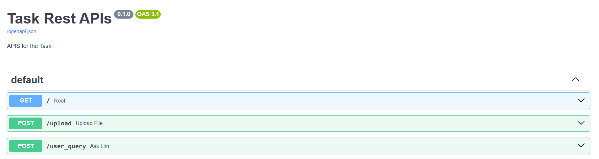
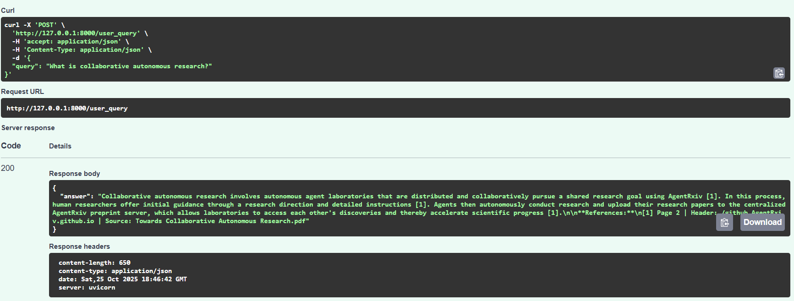

# Document Processing & RAG System

A comprehensive document processing and Retrieval-Augmented Generation (RAG) system built with FastAPI, MongoDB, and Google's Gemini AI. This system processes PDF documents, converts them to structured markdown, creates embeddings, and provides intelligent question-answering capabilities.

## Features

- **PDF Processing**: High-quality PDF to markdown conversion using Docling
- **Intelligent Chunking**: Header-based and character-based text splitting
- **Vector Search**: MongoDB Atlas vector search with Google embeddings
- **RAG Pipeline**: Context-aware question answering with Gemini AI
- **REST API**: FastAPI-based endpoints for file upload and querying
- **Logging**: Comprehensive logging system with file and console output

## Prerequisites

- Python 3.10+
- MongoDB Atlas account
- Google AI API key (for Gemini)

## Installation

1. **Clone the repository**
   ```bash
   git clone https://github.com/jascodebrewer/Document-Retrieval-System.git
   cd DocumentRetrievalSystem
   ```

2. **Install dependencies**
   ```bash
   pip install -r requirements.txt
   ```

3. **Set up environment variables**
   Create a `.env` file in the root directory:
   ```env
   MONGO_URI=your_mongodb_atlas_connection_string
   MONGO_DB=your_database_name
   MONGO_COLLECTION=your_collection_name
   MONGO_VECTOR_INDEX=your_vector_index_name
   GEMINI_API_KEY=your_gemini_api_key
   ```

## Architecture

### Document Processing Pipeline

1. **PDF Upload** → **Docling Conversion** → **Markdown with Page Numbers**
2. **Header-based Splitting** → **Character-based Chunking** → **Vector Embeddings**
3. **MongoDB Storage** → **Vector Search** → **RAG Response**

### Key Components

- **`src/data_processing/pdf_processor.py`**: PDF to markdown conversion using Docling
- **`src/chunking/data_chunking.py`**: Intelligent text chunking strategies
- **`src/database/mongo_utils.py`**: MongoDB operations and vector search
- **`src/llm_client/gemini_llm.py`**: Google Gemini AI integration
- **`rest_api.py`**: FastAPI application with endpoints

## Usage

### Starting the Server

```bash
python run.py
```

The server will start at `http://127.0.0.1:8000`

### API Endpoints

#### 1. Upload and Process PDF
```http
POST /upload
Content-Type: multipart/form-data

file: [PDF file]
```

**Response:**
```json
{
  "message": "File processed successfully",
  "filename": "document.pdf",
  "embeddings_count": 150,
  "chunks_count": 150
}
```

#### 2. Ask Questions
```http
POST /user_query
Content-Type: application/json

{
  "query": "What is collaborative autonomous research?"
}
```

**Response:**
```json
{
  "answer": "Collaborative autonomous research is... [with citations]"
}
```

#### 3. View API Documentation
Visit `http://127.0.0.1:8000/docs` for interactive API documentation.

## Important Performance Notes

### Processing Time Considerations

**Docling Processing**: The PDF processing using Docling can take significant time, especially for:
- Large PDF files 
- Complex documents with tables, images, and formatting
- CPU-only processing (no GPU acceleration)

**Why Docling?**
- **Open Source**: Free and community-driven
- **High Quality**: Superior table extraction and formatting preservation
- **Markdown Output**: Perfect for heading-based chunking
- **Accuracy**: Better handling of complex layouts compared to alternatives

**Alternative Libraries** (if you prefer different approaches):
- **PyMuPDF**: Faster but less accurate table extraction
- **LlamaParser**: Good for text extraction but limited table support

## Project Structure
```
DocumentRetrievalSystem/
├── src/
│   ├── data_processing/
│   │   └── pdf_processor.py          # Docling PDF processing
│   ├── chunking/
│   │   └── data_chunking.py          # Text splitting strategies
│   ├── database/
│   │   └── mongo_utils.py            # MongoDB operations
│   ├── llm_client/
│   │   ├── gemini_llm.py            # Gemini AI integration
│   │   └── google_embedder.py      # Google embeddings
│   └── prompts/
│       └── llm_prompt.txt           # RAG prompt template
├── data/                            # Input PDF files
├── output/                          # Processed files and logs
│   ├── markdown/                    # Converted markdown files
│   ├── doc_header_splits/          # Header-based chunks
│   ├── doc_char_splits/            # Character-based chunks
│   └── app.log                     # Application logs
├── rest_api.py                     # FastAPI application
├── run.py                          # Server startup
├── utils.py                        # Logging utilities
└── requirements.txt                # Dependencies
```

## Configuration

### Chunking Parameters
- **Header Split**: Based on `##` headings
- **Character Split**: 1000 characters with 100 character overlap
- **Page Detection**: Automatic page number extraction

### Vector Search
- **Embeddings**: Google's text-embedding-004 (768 dimensions)
- **Similarity**: Cosine similarity
- **Index Fields**: Text, metadata (source, page, header)

### LLM Settings
- **Model**: Gemini 2.5 Flash
- **Temperature**: 0 (deterministic responses)
- **Max Retries**: 2

## Monitoring

### Logs
- **File**: `output/app.log`
- **Console**: Real-time logging
- **Format**: Timestamp - Level - Message

## Development Workflow

1. **Upload PDF** → System processes and stores embeddings
2. **Query System** → Retrieves relevant chunks and generates answers
3. **Monitor Logs** → Check `output/app.log` for processing status
4. **View Results** → Check `output/` folder for intermediate files

## API Documentation



Visit `http://127.0.0.1:8000/docs`

---

## Example: User Query & Answer

**Query**: "What is collaborative autonomous research?"



## Future Enhancements (Roadmap)

While the current system provides a robust RAG pipeline for single-document processing, several powerful extensions can be planned to make it **production-ready** and **scalable**.

| Feature | Description | Benefit |
|--------|-------------|--------|
| **Multi-Document Upload & Querying** | Support uploading and querying across **multiple PDFs** simultaneously | Enable knowledge bases (e.g., research paper collections) |
| **Session-Based Context** | Track conversation history per user/session | Smarter follow-up questions (e.g., "Compare with the previous paper") |
| **Caching Layer** | Cache embeddings, search results, and LLM responses | Reduce latency and API costs |
| **Background Job Processing** | Offload PDF processing to async workers | Prevent API timeouts on large files |
| **Cloud Storage (AWS S3 / GCS)** | Store input PDFs and markdown outputs in secure cloud buckets | Decouple storage from local disk |
